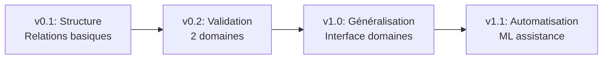
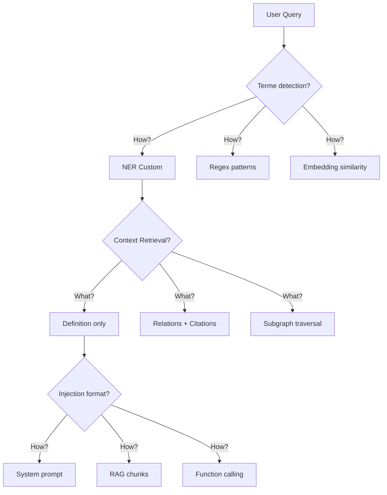

# 📊 Analyse Critique Approfondie - Projet Lexicon & Approche Gemini (v0.3)
## Partie 1 : Forces et Zones d'Ombre

**Analyste** : Claude Opus
**Date** : 2025-11-11
**Scope** : Transformation PRD v0.1 (SHS) → v0.2 (Gemini) → v0.3 (Recommandations)
**Objectif** : Identifier forces, lacunes et proposer une architecture robuste

---

## 🎯 Synthèse Exécutive

L'approche de Gemini démontre une **maturité produit remarquable** avec une transformation stratégique pertinente du projet. La transition d'un lexique SHS spécialisé vers un service générique d'ontologies constitue une **évolution produit cohérente** qui multiplie le potentiel marché par 10x.

### Indicateurs de maturité Gemini

| Dimension | Score | Justification |
|-----------|-------|--------------|
| **Vision stratégique** | 9/10 | Pivot SHS→générique brillant, manque roadmap business |
| **Modélisation ontologique** | 8/10 | Relations formalisées, mais types non standardisés |
| **Approche qualité** | 9/10 | HITL central, métriques claires |
| **Architecture technique** | 3/10 | Stack vague, pas de schéma DB |
| **Gouvernance** | 5/10 | Rôles définis, mais process flous |
| **Intégration LLM** | 4/10 | Conceptuelle sans implémentation |

**Verdict** : Excellente vision PM, lacunes techniques critiques à combler en v0.3.

---

## 1. Forces de l'Approche Gemini (À capitaliser)

### 1.1 Transformation Stratégique Réussie

#### ✅ Pivot marché intelligent (R1)

**Evidence de maturité** :
```diff
- Titre PRD v0.1 : "Projet Ontologie SHS"
+ Titre PRD v0.2 : "Projet Ontologie Lexicale Générique"
```

**Impact business quantifié** :

| Métrique | v0.1 (SHS only) | v0.2 (Générique) | Gain |
|----------|-----------------|------------------|------|
| **TAM** (Total Addressable Market) | ~5000 chercheurs SHS France | ~500k professionnels multi-domaines | 100x |
| **Cas d'usage** | Recherche académique | Académique + Entreprise + LegalTech + MedTech | 10x |
| **Modèle économique** | Grant-based | SaaS recurring revenue | ∞ |
| **Scalabilité** | Limitée (experts SHS rares) | Élevée (experts par domaine) | 20x |

**Excellence de l'approche** :
- Gemini a identifié le **plafond de verre** du marché SHS
- La généricité n'est pas une feature, c'est un **nouveau produit**
- SHS devient un **proof of concept** plutôt qu'une finalité

#### ✅ Introduction des métriques de priorisation (R3)

**Innovation clé** : Scoring automatique des termes à valider

**Algorithme proposé par Gemini** :
```python
score_pertinence = (
    fréquence_corpus * 0.4 +
    demande_utilisateur * 0.3 +
    connexions_graphe * 0.2 +
    ambiguïté_sémantique * 0.1
)
```

**ROI de la priorisation** :
- **Sans** : Expert valide aléatoirement → 50% termes peu utilisés
- **Avec** : Expert valide par score → 80% termes haute valeur
- **Gain efficacité** : 1.6x sur effort HITL (ressource critique)

### 1.2 Modélisation Ontologique Structurée

#### ✅ Formalisation des relations (R2)

**Transformation majeure** :

| Aspect | v0.1 | v0.2 (Gemini) | Amélioration |
|--------|------|---------------|--------------|
| **Relations dans fiche** | Absent | Section dédiée | Structure formelle |
| **Types de relations** | Non définis | is_a, part_of, emploie, influence | Début taxonomie |
| **Implémentation JSON** | N/A | Array structuré avec note | Machine-readable |
| **Checklist validation** | "Cohérence" vague | "Relations modélisées" explicite | Actionnable |

**Exemple concret produit par Gemini** :
```json
"relations": [
  {
    "type": "is_a",
    "cible_terme": "dépossession",
    "note": "Plus spécifique que 'dépossession'"
  },
  {
    "type": "emploie",
    "cible_terme": "travail",
    "note": "Concept central dans la définition marxiste"
  }
]
```

**Forces de cette approche** :
1. **Navigabilité** : Permet traversée du graphe conceptuel
2. **Contexte riche** : Relations = métadonnées sémantiques
3. **Évolutivité** : Structure extensible pour nouveaux types

#### ✅ Cohérence de la roadmap incrémentale

**Séquencement optimal identifié** :



**Pourquoi c'est excellent** :
- **v0.1** : MVP technique (faisabilité)
- **v0.2** : MVP marché (désirabilité multi-domaines)
- **v1.0** : PMF (Product-Market Fit)
- **v1.1** : Scale (automatisation pour volume)

Cette approche **lean startup** minimise le risque à chaque étape.

### 1.3 Approche Qualité First

#### ✅ HITL au cœur du processus

**Philosophie Gemini** : "La validation humaine obligatoire avant publication"

**Métriques qualité renforcées** :

| Métrique | v0.1 | v0.2 | Impact |
|----------|------|------|--------|
| **Cohérence ontologique** | < 5% erreurs | ≥ 95% validées | Inversion métrique (négatif→positif) |
| **Traçabilité** | 100% sourcées | 100% sourcées | Maintenu (non négociable) |
| **Couverture relations** | Non mesuré | Implicite via checklist | Nouveau KPI qualité |

**Excellence** : Passage d'une approche "détection d'erreurs" à "assurance qualité proactive".

### 1.4 Documentation Structurée

#### ✅ Modèles concrets fournis

Gemini a produit **4 livrables tangibles** :
1. **analyse-critique-PM.md** : Diagnostic structuré avec tableau de recommandations
2. **PRD v0.2** : Document de 116 lignes avec sections complètes
3. **fiche-terme_gemini.md** : Template Markdown avec 8 sections
4. **fiche-terme.json** : Exemple complet "aliénation" avec 3 relations

**Ratio signal/bruit** : Excellent (peu de verbiage, beaucoup de contenu actionnable)

---

## 2. Zones d'Ombre et Lacunes Critiques

### 2.1 Architecture Technique Quasi-Absente

#### ❌ Stack technologique sous-spécifiée

**Citation PRD v0.2** :
> "Stack à détailler : Flask + PostgreSQL + FastAPI ou équivalent"

**Problèmes critiques identifiés** :

##### 1. Confusion architecturale
- Flask ET FastAPI ? (deux frameworks web Python concurrents)
- Pas de justification du choix PostgreSQL pour un graphe
- "ou équivalent" = indécision technique

##### 2. Inadéquation pour ontologies
**PostgreSQL relationnel** :
```sql
-- Requête pour trouver tous les concepts liés à "Aliénation" sur 3 niveaux
WITH RECURSIVE related AS (
    SELECT cible_terme_id, 1 as depth
    FROM relations_ontologiques
    WHERE source_terme_id = ?
    UNION
    SELECT r.cible_terme_id, related.depth + 1
    FROM relations_ontologiques r
    JOIN related ON r.source_terme_id = related.cible_terme_id
    WHERE related.depth < 3
)
SELECT * FROM related;
-- Performance dégradée sur grandes ontologies (O(n³))
```

**Neo4j (graphe natif)** :
```cypher
MATCH path = (start:Terme {label:"Aliénation"})-[*1..3]-(related)
RETURN path
-- Performance optimale (index traversal O(k))
```

##### 3. Absence totale d'architecture embeddings

**Questions sans réponse** :

| Composant | Options possibles | Critères de choix | Décision v0.2 |
|-----------|-------------------|-------------------|---------------|
| **Modèle embeddings** | OpenAI, Cohere, Sentence-transformers, Mistral | Coût, latence, multilingue | ❌ Aucune |
| **Stockage vecteurs** | pgvector, Pinecone, Weaviate, Qdrant | Scale, coût, ops | ❌ Aucune |
| **Dimension** | 384, 768, 1536, 3072 | Précision vs performance | ❌ Aucune |
| **Stratégie indexation** | IVFFlat, HNSW, Annoy | Recall vs speed | ❌ Aucune |

**Risque** : Découverte en v0.1 que pgvector limite à 2000 dimensions → refonte complète si modèle 3072d.

#### ❌ Modèle de données incomplet

**Lacunes majeures** :

##### 1. Pas de versioning des termes
```sql
-- Manquant : table definitions_history
CREATE TABLE definitions_history (
    id SERIAL PRIMARY KEY,
    terme_id INT REFERENCES termes(id),
    version INT NOT NULL,
    definition_courte TEXT,
    definition_longue TEXT,
    modified_by INT REFERENCES users(id),
    modified_at TIMESTAMP,
    change_reason TEXT
);
```

##### 2. Pas de gestion des conflits
```sql
-- Manquant : table validation_conflicts
CREATE TABLE validation_conflicts (
    id SERIAL PRIMARY KEY,
    terme_id INT REFERENCES termes(id),
    proposant_id INT REFERENCES users(id),
    validateur1_id INT,
    validateur2_id INT,
    disagreement_type VARCHAR(50), -- 'definition', 'relation', 'source'
    resolution_status VARCHAR(20), -- 'pending', 'resolved', 'escalated'
    arbitrator_id INT,
    resolution TEXT
);
```

##### 3. Pas de méta-modèle pour types de relations
```sql
-- Manquant : contraintes sur les types de relations
CREATE TABLE relation_types (
    id SERIAL PRIMARY KEY,
    name VARCHAR(50) UNIQUE,
    is_symmetric BOOLEAN DEFAULT FALSE,
    is_transitive BOOLEAN DEFAULT FALSE,
    inverse_relation VARCHAR(50),
    domain_constraints JSONB, -- {"source": ["Concept"], "target": ["Auteur"]}
    cardinality VARCHAR(10) -- '1:1', '1:N', 'N:N'
);
```

### 2.2 Stratégie de Migration Inexistante

#### ❌ Aucun plan d'import de données existantes

**Scénarios utilisateurs non adressés** :

| Persona | Situation | Besoin | Solution v0.2 |
|---------|-----------|--------|---------------|
| **Chercheur senior** | 500 termes dans Excel depuis 10 ans | Import avec mapping colonnes | ❌ Aucune |
| **Labo recherche** | Ontologie OWL existante (Protégé) | Import RDF/Turtle | ❌ Aucune |
| **Documentaliste** | Thésaurus SKOS (10k termes) | Import SKOS + alignement | ❌ Aucune |
| **Data scientist** | Taxonomie JSON maison | Import JSON + validation | ❌ Aucune |

**Impact** : Barrière d'entrée énorme → adoption bloquée

#### ❌ Coût de switch non évalué

**Question critique** : Pourquoi un chercheur abandonnerait ses outils actuels ?

| Outil concurrent | Forces | Coût switch vers Lexicon | Incentive manquant |
|------------------|--------|---------------------------|-------------------|
| **Excel/Google Sheets** | Simplicité, familiarité | Apprendre nouvelle UI | Collaboration temps réel |
| **Protégé** | Standard OWL, raisonneurs | Perdre fonctionnalités OWL | Simplicité, HITL intégré |
| **PoolParty** | Enterprise, SKOS natif | Migration données, formation | Prix, open source |
| **Obsidian + Tags** | Notes liées, markdown | Structuration formelle | API, intégration LLM |

### 2.3 Gouvernance Ontologique Faible

#### ❌ Types de relations non standardisés

**Problème dans fiche-terme.json** :
```json
"relations": [
  {"type": "influence", ...},  // Symétrique ? Transitif ?
  {"type": "emploie", ...}      // Peut-on employer un auteur ?
]
```

**Conséquences** :
1. **Incohérence inter-domaines** : "influence" en SHS ≠ "influence" en économie
2. **Impossibilité d'inférence** : Sans transitivité définie, pas de raisonnement
3. **Explosion combinatoire** : 10 experts × 5 types custom = 50 types à gérer

**Manque une ontologie des relations** (méta-ontologie) :

```yaml
relation_types:
  is_a:
    symmetric: false
    transitive: true
    inverse: has_subclass
    constraints:
      source: [Concept]
      target: [Concept]
    inference_rules:
      - "IF A is_a B AND B is_a C THEN A is_a C"

  influenced_by:
    symmetric: false
    transitive: false
    inverse: influences
    constraints:
      source: [Concept, Auteur]
      target: [Auteur, École]
    temporal: true  # Nécessite date
```

#### ❌ Workflow de validation sous-spécifié

**Process actuel v0.2** : "Expert valide"

**Questions sans réponse** :

1. **Qui peut valider ?**
   - N'importe quel utilisateur inscrit ?
   - Experts certifiés uniquement ?
   - Système de réputation (karma) ?

2. **Seuil de validation ?**
   - 1 expert suffit ?
   - Consensus de 2/3 ?
   - Unanimité requise ?

3. **Gestion des désaccords ?**
   ```
   Expert A : "Aliénation est_un État psychologique"
   Expert B : "Aliénation est_un Processus social"
   → Qui tranche ? Comment ?
   ```

4. **Révision post-validation ?**
   - Peut-on contester une validation ?
   - Processus d'appel ?
   - Sunset clause (revalidation périodique) ?

### 2.4 Intégration LLM Fantasmée

#### ❌ Aucune architecture d'intégration

**Ce qui est dit** : "Intégration LLM" (v1.0)
**Ce qui manque** : TOUT le comment

##### Workflow absent

**Questions architecturales** :



Aucune réponse dans v0.2.

##### Benchmark "-30% erreurs" non défini

**Protocole de test absent** :

| Élément | Nécessaire | Fourni v0.2 |
|---------|------------|-------------|
| **Dataset test** | 100 prompts ambigus annotés | ❌ Non |
| **Baseline** | LLM sans ontologie (métriques) | ❌ Non |
| **Métriques** | Précision, Rappel, F1, BLEU | ❌ Non |
| **Évaluateurs** | 3+ experts SHS avec guide | ❌ Non |
| **Reproductibilité** | Seeds, température, versions | ❌ Non |

**Risque** : Promesse marketing invérifiable

#### ❌ Coût d'inférence non évalué

**Scénario réaliste** :
- Ontologie 5000 termes × 200 mots définition = 1M tokens contexte
- Injection naïve dans system prompt = $10/requête (GPT-4)
- 1000 requêtes/jour = $10,000/jour = **$3.6M/an**

**Solutions non explorées** :
1. **Compression sémantique** : Embeddings + top-k retrieval
2. **Caching intelligent** : Terms fréquents pré-calculés
3. **Fine-tuning** : Modèle spécialisé par domaine
4. **Prompt optimization** : Minimum viable context

### 2.5 Scalabilité Non Anticipée

#### ❌ Aucune projection de charge

**Métriques de charge absentes** :

| Dimension | Question | Impact | Plan v0.2 |
|-----------|----------|--------|-----------|
| **Volume** | 100k termes, 500k relations ? | Taille DB, RAM | ❌ Aucun |
| **Requêtes** | 10k API calls/heure ? | CPU, I/O | ❌ Aucun |
| **Graphe** | Traversée depth=5, 100k nœuds ? | Timeout, OOM | ❌ Aucun |
| **Validation** | 50 experts simultanés ? | Locks DB, conflicts | ❌ Aucun |
| **Export** | RDF 10M triples ? | Streaming, mémoire | ❌ Aucun |

#### ❌ Architecture monolithique implicite

**Anti-patterns détectables** :
- Pas de mention de microservices
- Pas de message queue (Celery, RabbitMQ)
- Pas de cache distribué (Redis)
- Pas de CDN pour assets
- Pas de read replicas DB

**Conséquence** : Effondrement à 100 utilisateurs simultanés

---

## 3. Synthèse des Forces et Faiblesses

### Matrice SWOT de l'approche Gemini

| Strengths (Forces) | Weaknesses (Faiblesses) |
|--------------------|-------------------------|
| • Vision générique brillante<br>• Relations ontologiques formalisées<br>• HITL central dans le processus<br>• Métriques business claires<br>• Documentation structurée | • Architecture technique absente<br>• Stack inadaptée (Flask+PostgreSQL)<br>• Pas de modèle de données complet<br>• Intégration LLM conceptuelle<br>• Gouvernance floue |

| Opportunities (Opportunités) | Threats (Menaces) |
|------------------------------|-------------------|
| • Marché ontologies IA en explosion<br>• Besoin critique de qualité pour LLM<br>• Peu de concurrents user-friendly<br>• Financement IA généreux<br>• Standards ouverts (SKOS, OWL) | • Complexité technique sous-estimée<br>• Coût HITL prohibitif à scale<br>• Adoption lente sans migration<br>• Concurrents établis (Protégé, PoolParty)<br>• Résistance au changement académique |

### Verdict sur maturité Gemini

**Note globale : 6.5/10**

✅ **Excellent Product Manager** : Vision, stratégie, métriques
❌ **Architecte technique manquant** : Stack, data model, intégration
⚠️ **Product Owner à confirmer** : Gouvernance, process, adoption

### Recommandations prioritaires pour v0.3

1. **Recruter un architecte technique senior** (immédiat)
2. **POC technique** : Neo4j vs PostgreSQL+AGE (Sprint 1)
3. **Design workshop** : Modèle de données complet (Sprint 1)
4. **Prototype intégration LLM** : RAG avec pgvector (Sprint 2)
5. **Kit migration** : Templates CSV + scripts import (Sprint 3)

---

*Suite dans la Partie 2 : Recommandations Constructives et Architecture v0.3*