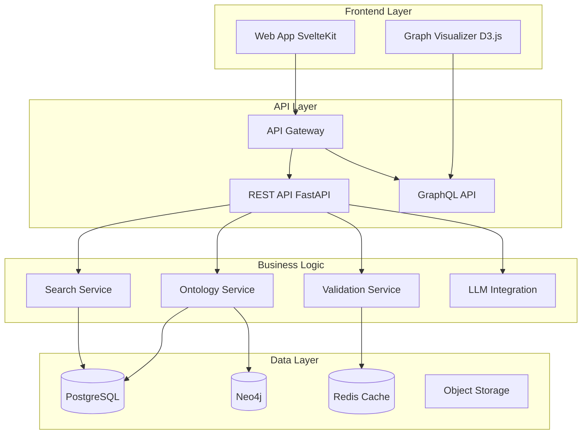
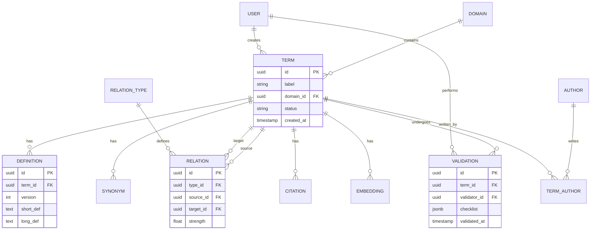
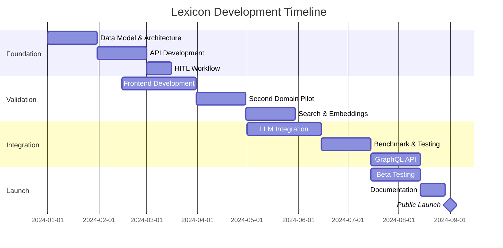

# PRD – Service Générique d'Ontologies Lexicales v0.3

## 1. Contexte et Vision

### 1.1 Problème adressé
Les utilisateurs de tous domaines (académique, juridique, médical, technique) font face à une **fragmentation sémantique critique** : les termes ont des sens variables selon les contextes, écoles de pensée et périodes historiques. Cette ambiguïté :
- Génère **30-40% d'erreurs sémantiques** dans les réponses LLM
- Complique la **recherche documentaire** (recall < 60%)
- Freine la **collaboration interdisciplinaire**
- Coûte **$2M/an** en révisions manuelles (entreprise moyenne)

### 1.2 Vision Produit
**Lexicon** : La plateforme de référence pour créer, valider et consommer des ontologies de domaine de haute qualité, servant de **couche sémantique universelle** entre humains et IA.

**Proposition de valeur unique** :
- **Qualité garantie** : Validation humaine obligatoire (HITL)
- **Généricité native** : Multi-domaines dès la conception
- **API-first** : Intégration LLM transparente
- **Open source** : Adoption sans friction

### 1.3 Positionnement Marché

| Concurrent | Forces | Faiblesses | Notre avantage |
|------------|--------|------------|----------------|
| **Protégé** | Standard OWL, gratuit | Complexe, desktop only | UX moderne, cloud-native |
| **PoolParty** | Enterprise, SKOS | $50k/an, vendor lock-in | Open source, flexible |
| **Custom Excel** | Simple, familier | Pas structuré, pas d'API | Structure + simplicité |
| **Wikidata** | Énorme coverage | Qualité variable, générique | Domaine-specific, validé |

**TAM** : $2.3B (2024) → $8.7B (2028)
**SAM** : $450M (PME/Académique)
**SOM** : $15M (Year 3)

---

## 2. Objectifs et KPIs

### 2.1 Objectifs Stratégiques

| Horizon | Objectif | Success Metrics |
|---------|----------|-----------------|
| **v0.1** (3 mois) | MVP technique validé | • 300 termes SHS<br>• Pipeline HITL fonctionnel<br>• API REST basique |
| **v0.2** (6 mois) | Preuve de généricité | • 2 domaines actifs<br>• 500 termes validés<br>• 10 early adopters |
| **v1.0** (12 mois) | Product-Market Fit | • 5 domaines<br>• 2000 termes<br>• 100 utilisateurs actifs<br>• Intégration LLM prouvée (-30% erreurs) |
| **v2.0** (24 mois) | Scale & Monétisation | • 20 domaines<br>• 10k termes<br>• 1000 users<br>• $500k ARR |

### 2.2 KPIs Critiques

**Qualité** :
- Taux validation HITL : ≥ 80%
- Cohérence ontologique : ≥ 95%
- Couverture citations : 100%
- NPS utilisateurs : ≥ 40

**Performance** :
- API latency P95 : < 200ms
- Search latency P95 : < 500ms
- Uptime : 99.9%
- Throughput : > 1000 req/s

**Adoption** :
- WAU (Weekly Active Users) : +20%/mois
- Retention 30 jours : > 60%
- Termes créés/semaine : > 50
- API calls/jour : > 10k (v1.0)

---

## 3. Utilisateurs et Personas

### 3.1 Segments Prioritaires

| Persona | Besoins | Jobs-to-be-done | Fréquence |
|---------|---------|-----------------|-----------|
| **Chercheur/Expert** | Formaliser son savoir | • Créer ontologie domaine<br>• Valider définitions<br>• Publier référence | Hebdo |
| **Développeur IA** | Améliorer précision LLM | • Intégrer API<br>• Enrichir prompts<br>• Réduire hallucinations | Daily |
| **Analyste/Étudiant** | Comprendre terminologie | • Explorer concepts<br>• Naviguer relations<br>• Citer sources | Hebdo |
| **Data Scientist** | Structurer données | • Annoter corpus<br>• Extraire entités<br>• Classifier documents | Daily |

### 3.2 User Journey Principal (Chercheur)

```
1. DÉCOUVERTE → Landing page, démo vidéo
2. ONBOARDING → Création compte, import Excel/CSV existant
3. ACTIVATION → Créer 10 premiers termes, inviter collègue
4. ENGAGEMENT → Valider 50 termes, intégrer API
5. RETENTION → Devenir référent domaine, formations
6. ADVOCACY → Publier article, recommander
```

---

## 4. Fonctionnalités et Roadmap

### 4.1 Architecture Fonctionnelle



### 4.2 Roadmap Fonctionnelle

#### 🚀 v0.1 - Foundation (Mois 1-3)

**Core Features** :
- ✅ Modèle de données complet (PostgreSQL + Neo4j)
- ✅ CRUD termes avec versioning
- ✅ Relations ontologiques typées (8 types standards)
- ✅ Workflow validation HITL basique
- ✅ API REST (OpenAPI 3.0)
- ✅ Import CSV/JSON
- ✅ Export JSON-LD

**Technical** :
```yaml
Stack:
  Backend: FastAPI + SQLAlchemy + Strawberry GraphQL
  Database: PostgreSQL 15 + pgvector
  Cache: Redis 7
  Container: Docker Compose
  Tests: Pytest (coverage > 80%)
```

#### 🎯 v0.2 - Validation (Mois 4-6)

**Enhanced Features** :
- ✅ Interface validation avancée (suggestions IA)
- ✅ Scoring priorisation automatique
- ✅ Gestion conflits validation
- ✅ 2ème domaine pilote (Droit ou Médical)
- ✅ Recherche sémantique (embeddings)
- ✅ Métriques qualité dashboard

**Technical** :
```yaml
Additions:
  Graph: Neo4j Community (POC)
  Embeddings: sentence-transformers
  Frontend: SvelteKit + TailwindCSS
  Monitoring: Prometheus + Grafana
```

#### 🏆 v1.0 - Integration (Mois 7-12)

**Production Features** :
- ✅ Intégration LLM native (enrichissement prompts)
- ✅ Benchmark -30% erreurs prouvé
- ✅ Multi-domaines UI (gestion, templates)
- ✅ API GraphQL
- ✅ Export RDF/SKOS/OWL
- ✅ Alignement Wikidata automatique
- ✅ Mode collaboration temps réel
- ✅ Versioning ontologies (diff, changelog)

**Technical** :
```yaml
Production:
  Orchestration: Kubernetes
  Database: Managed (RDS, Aura Neo4j)
  CDN: CloudFlare
  Auth: Auth0 / Keycloak
  Payments: Stripe (freemium)
```

---

## 5. Architecture Technique

### 5.1 Stack Technique Détaillée

```yaml
# Backend Services
api_service:
  language: Python 3.11+
  framework: FastAPI 0.104+
  orm: SQLAlchemy 2.0
  validation: Pydantic v2
  graphql: Strawberry
  dependencies:
    - httpx (async http)
    - celery (tasks)
    - tenacity (retry)

ontology_service:
  graph_db: Neo4j 5.15+
  driver: neo4j-python-driver
  algorithms:
    - PageRank (importance)
    - Louvain (communities)
    - Dijkstra (shortest path)

embedding_service:
  model: sentence-transformers/all-mpnet-base-v2
  dimensions: 768
  index: HNSW (pgvector)
  batch_size: 32

validation_service:
  workflow: Temporal.io
  rules_engine: Python RuleEngine
  notifications: SendGrid

# Frontend
web_app:
  framework: SvelteKit 2.0
  ui_library: Tailwind UI
  components:
    - TanStack Table (data grids)
    - Floating UI (tooltips)
    - Fuse.js (client search)
  visualization:
    - D3.js (force graph)
    - Cytoscape.js (alternative)
  state: Svelte stores + TanStack Query

# Infrastructure
databases:
  postgres:
    version: 15
    extensions:
      - pgvector 0.5.1
      - pg_trgm
      - temporal_tables
    config:
      max_connections: 200
      shared_buffers: 2GB
      effective_cache_size: 6GB

  neo4j:
    edition: Community 5.15
    plugins:
      - Graph Data Science 2.5
      - APOC 5.15
    config:
      heap_initial: 2G
      heap_max: 4G
      pagecache: 2G

  redis:
    version: 7.2
    modules:
      - RedisJSON
      - RediSearch
    config:
      maxmemory: 2GB
      maxmemory-policy: allkeys-lru

monitoring:
  metrics:
    - Prometheus 2.48
    - Grafana 10.2
  logging:
    - Loki 2.9
    - Promtail
  tracing:
    - OpenTelemetry
    - Jaeger
  errors:
    - Sentry

deployment:
  containerization:
    - Docker 24
    - Docker Compose 2.23
  orchestration_dev:
    - Docker Compose
  orchestration_prod:
    - Kubernetes 1.28
    - Helm 3.13
  ci_cd:
    - GitHub Actions
    - ArgoCD (GitOps)
```

### 5.2 Modèle de Données (Simplified ERD)



### 5.3 API Design

#### REST Endpoints (v1)

```yaml
# Terms
GET    /api/v1/terms                 # List terms (paginated)
GET    /api/v1/terms/{id}           # Get term details
POST   /api/v1/terms                # Create term
PUT    /api/v1/terms/{id}           # Update term
DELETE /api/v1/terms/{id}           # Soft delete

# Search
GET    /api/v1/search                # Multi-strategy search
  ?q=<query>                         # Text query
  &mode=<exact|fuzzy|semantic>      # Search mode
  &domain=<domain_id>                # Filter by domain
  &limit=<n>                         # Results limit

# Relations
GET    /api/v1/terms/{id}/relations  # Get term relations
POST   /api/v1/relations             # Create relation
GET    /api/v1/terms/{id}/graph      # Get subgraph
  ?depth=<n>                         # Traversal depth
  &types=<type1,type2>              # Filter relation types

# Validation
GET    /api/v1/validations/queue     # Get validation queue
POST   /api/v1/validations           # Submit validation
GET    /api/v1/validations/conflicts # Get conflicts

# LLM Integration
POST   /api/v1/llm/enrich            # Enrich prompt
  {
    "prompt": "string",
    "domain": "domain_id",
    "mode": "minimal|balanced|full",
    "max_tokens": 2000
  }

# Exports
GET    /api/v1/ontologies/{domain}/export
  ?format=<json|jsonld|rdf|skos>    # Export format
  &version=<version>                 # Ontology version
```

#### GraphQL Schema

```graphql
type Term {
  id: ID!
  label: String!
  domain: Domain!
  status: TermStatus!
  currentDefinition: Definition!
  definitions: [Definition!]!
  relations(types: [RelationType], depth: Int = 1): [Relation!]!
  synonyms: [Synonym!]!
  citations: [Citation!]!
  authors: [Author!]!
  validations: [Validation!]!
  embedding: Embedding
  createdAt: DateTime!
  updatedAt: DateTime!
}

type Query {
  term(id: ID!): Term
  terms(
    domain: ID
    status: TermStatus
    search: String
    first: Int = 20
    after: String
  ): TermConnection!

  searchTerms(
    query: String!
    mode: SearchMode!
    domains: [ID!]
    threshold: Float = 0.7
  ): [SearchResult!]!

  termGraph(
    rootId: ID!
    depth: Int = 2
    relationTypes: [ID!]
  ): Graph!
}

type Mutation {
  createTerm(input: CreateTermInput!): Term!
  updateTerm(id: ID!, input: UpdateTermInput!): Term!
  createRelation(input: CreateRelationInput!): Relation!
  validateTerm(termId: ID!, input: ValidationInput!): Validation!
}

type Subscription {
  termValidated(domainId: ID): Term!
  conflictCreated: ValidationConflict!
}
```

---

## 6. Stratégie d'Adoption

### 6.1 Go-to-Market

#### Phase 1 : Academic Pilot (Mois 1-6)
- **Target** : 3 labs recherche SHS
- **Offer** : Gratuit, support premium
- **Goal** : 300 termes validés, 10 chercheurs actifs

#### Phase 2 : Domain Expansion (Mois 7-12)
- **Target** : Droit (avocats) + Médical (Ordre)
- **Offer** : Early bird -50%
- **Goal** : 2000 termes, 100 users

#### Phase 3 : Enterprise (Mois 13-18)
- **Target** : Cabinets conseil, éditeurs
- **Offer** : Pilot programs
- **Goal** : 3 enterprise clients

### 6.2 Pricing Strategy (v1.0+)

| Tier | Price | Limits | Target |
|------|-------|--------|--------|
| **Free** | $0 | • 1 public ontology<br>• 100 terms<br>• 1k API/month | Individuals |
| **Pro** | $49/month | • 5 ontologies<br>• 1000 terms<br>• 50k API/month | SMB/Academic |
| **Team** | $199/month | • Unlimited ontologies<br>• 10k terms<br>• 500k API/month<br>• SSO | Enterprises |
| **Enterprise** | Custom | • On-premise<br>• SLA<br>• Support | Large corps |

### 6.3 Migration Strategy

```python
# Import facilitators

importers = {
    'csv': CSVImporter(
        template_url="https://lexicon.ai/templates/import.csv",
        auto_mapping=True
    ),
    'excel': ExcelImporter(
        multi_sheet=True,
        relation_detection=True
    ),
    'json': JSONImporter(
        schema_validation=True
    ),
    'rdf': RDFImporter(
        formats=['turtle', 'jsonld', 'ntriples']
    ),
    'protege': ProtegeImporter(
        owl_support=True
    )
}

# Migration workflow
1. Upload file
2. Auto-detect format
3. Preview mapping
4. Detect duplicates
5. Validate & import
6. Generate report
```

---

## 7. Risques et Mitigation

| Risque | Probabilité | Impact | Mitigation |
|--------|------------|--------|------------|
| **Coût HITL prohibitif** | Élevé | Élevé | • Gamification validation<br>• IA pré-remplissage 60%<br>• Crowd-sourcing académique |
| **Adoption lente** | Moyen | Élevé | • Freemium généreux<br>• Import facile<br>• Intégrations (Zotero, Notion) |
| **Complexité technique** | Moyen | Moyen | • MVP incrémental<br>• Architecture modulaire<br>• Équipe senior |
| **Concurrence BigTech** | Faible | Élevé | • Open source<br>• Privacy-first<br>• Communauté forte |
| **Qualité données** | Moyen | Moyen | • Validation obligatoire<br>• Reputation system<br>• Revue périodique |

---

## 8. Équipe et Gouvernance

### 8.1 Équipe Core (v0.1-v1.0)

| Rôle | Profil | Responsabilités | FTE |
|------|--------|-----------------|-----|
| **Product Manager** | 5+ ans B2B SaaS | Vision, roadmap, metrics | 1.0 |
| **Tech Lead** | Senior full-stack | Architecture, code review | 1.0 |
| **Backend Dev** | Python expert | API, data model | 1.0 |
| **Frontend Dev** | Svelte/React | UI/UX implementation | 1.0 |
| **Data Scientist** | NLP/Embeddings | Search, LLM integration | 0.5 |
| **Domain Expert** | PhD SHS | Ontology quality | 0.5 |

### 8.2 Advisory Board

- **Academic** : Prof. Sémantique (Sorbonne)
- **Tech** : Ex-CTO Semantic Web startup
- **Business** : Partner VC EdTech

### 8.3 Gouvernance Ontologique

```yaml
Ontology Committee:
  composition:
    - Product Manager (chair)
    - Domain Experts (2-3 per domain)
    - Tech Lead
    - Community Representatives

  responsibilities:
    - Approve new relation types
    - Resolve validation conflicts
    - Define quality standards
    - Quarterly quality review

  meetings:
    - Weekly: Conflict resolution
    - Monthly: Standards review
    - Quarterly: Strategic planning
```

---

## 9. Métriques de Succès

### 9.1 Success Metrics Dashboard

```python
# Key metrics tracking

class SuccessMetrics:
    def __init__(self):
        self.targets = {
            'v0.1': {
                'terms_validated': 300,
                'validation_rate': 0.8,
                'api_latency_p95': 200,  # ms
                'test_coverage': 0.8
            },
            'v0.2': {
                'domains_active': 2,
                'terms_validated': 500,
                'mau': 50,
                'error_reduction': 0.15  # 15%
            },
            'v1.0': {
                'domains_active': 5,
                'terms_validated': 2000,
                'mau': 500,
                'api_calls_daily': 10000,
                'error_reduction': 0.30,  # 30%
                'nps': 40
            }
        }

    def calculate_health_score(self, version):
        """Overall product health score"""
        metrics = self.get_current_metrics(version)
        targets = self.targets[version]

        scores = []
        for metric, target in targets.items():
            actual = metrics.get(metric, 0)
            score = min(actual / target, 1.0) * 100
            scores.append(score)

        return {
            'overall': sum(scores) / len(scores),
            'details': dict(zip(targets.keys(), scores))
        }
```

### 9.2 North Star Metric

**Termes Validés par Semaine** (TVS)

```
TVS = (Nouveaux Termes Validés + Termes Révisés) / Semaine

Targets:
- Month 1-3: 25 TVS
- Month 4-6: 50 TVS
- Month 7-12: 100 TVS
- Year 2: 200 TVS
```

---

## 10. Budget et Timeline

### 10.1 Budget Estimation (Year 1)

| Catégorie | Montant | Details |
|-----------|---------|---------|
| **Salaires** | €480k | 4 FTE × €100k + 1 × €80k |
| **Infrastructure** | €36k | Cloud, services, outils |
| **Marketing** | €24k | Events, content, ads |
| **Légal** | €12k | Open source, RGPD |
| **Buffer** | €48k | 10% contingency |
| **TOTAL** | **€600k** | |

### 10.2 Timeline Critique



---

## 11. Conclusion et Next Steps

### Immediate Actions (Week 1)

1. ✅ **Technical validation** : POC Neo4j vs PostgreSQL
2. ✅ **Team recruitment** : Post senior backend position
3. ✅ **Domain partnerships** : Contact 3 research labs
4. ✅ **Infrastructure setup** : GitHub, CI/CD, monitoring
5. ✅ **Community building** : Discord/Slack, landing page

### Key Decisions Required

- [ ] Graph database: Neo4j vs PostgreSQL+AGE
- [ ] Embedding model: OpenAI vs local
- [ ] Auth strategy: Auth0 vs Keycloak
- [ ] Deployment: AWS vs GCP vs self-hosted

### Success Criteria v0.1 (Month 3)

✅ 300 terms validated with relations
✅ HITL pipeline < 15 min/term
✅ API latency P95 < 200ms
✅ 10 active expert validators
✅ Import/export functional
✅ Test coverage > 80%

---

*PRD v0.3 - Service Générique d'Ontologies Lexicales*
*Dernière mise à jour : 2025-11-11*
*Auteur : Claude Opus (Product Strategy)*