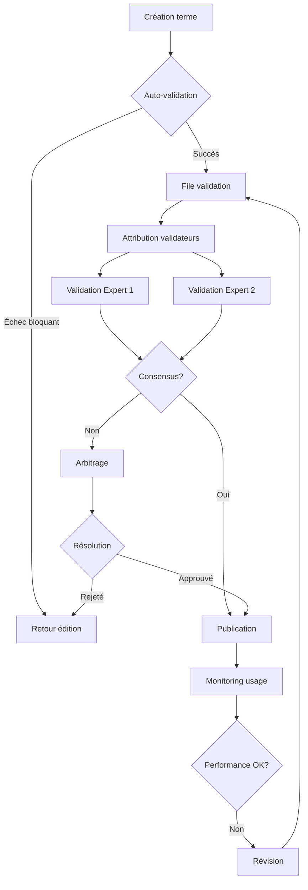

# Checklist de Validation HITL v0.3
## Service Générique d'Ontologies Lexicales

---

## 🤖 A. Critères Automatiques (Validation Système)

### A.1 Structure et Format

| # | Critère | Description | Validation | Sévérité |
|---|---------|-------------|------------|----------|
| A1.1 | **Identifiant unique** | UUID valide et unique dans la base | ☐ Auto | 🔴 Bloquant |
| A1.2 | **Slug unique** | Slug unique dans le domaine | ☐ Auto | 🔴 Bloquant |
| A1.3 | **Format JSON valide** | Structure JSON conforme au schéma | ☐ Auto | 🔴 Bloquant |
| A1.4 | **Champs obligatoires** | Tous les champs requis présents | ☐ Auto | 🔴 Bloquant |
| A1.5 | **Types de données** | Types corrects (string, number, array) | ☐ Auto | 🔴 Bloquant |

### A.2 Définitions

| # | Critère | Description | Validation | Sévérité |
|---|---------|-------------|------------|----------|
| A2.1 | **Définition courte présente** | Non vide, > 10 caractères | ☐ Auto | 🔴 Bloquant |
| A2.2 | **Longueur définition courte** | ≤ 200 caractères | ☐ Auto | 🟡 Warning |
| A2.3 | **Définition longue présente** | Non vide, > 50 mots | ☐ Auto | 🔴 Bloquant |
| A2.4 | **Longueur définition longue** | Entre 200-500 mots | ☐ Auto | 🟡 Warning |
| A2.5 | **Pas de duplication** | Définitions courte/longue différentes | ☐ Auto | 🟡 Warning |

### A.3 Relations Ontologiques

| # | Critère | Description | Validation | Sévérité |
|---|---------|-------------|------------|----------|
| A3.1 | **Au moins une relation** | Minimum 1 relation définie | ☐ Auto | 🔴 Bloquant |
| A3.2 | **Types valides** | Types dans le catalogue standard | ☐ Auto | 🔴 Bloquant |
| A3.3 | **Cibles existantes** | Tous les target_id existent | ☐ Auto | 🔴 Bloquant |
| A3.4 | **Pas d'auto-référence** | source_id ≠ target_id | ☐ Auto | 🔴 Bloquant |
| A3.5 | **Pas de cycle simple** | Pas de A→B et B→A avec même type | ☐ Auto | 🟡 Warning |
| A3.6 | **Force valide** | 0.0 ≤ strength ≤ 1.0 | ☐ Auto | 🔴 Bloquant |
| A3.7 | **Symétrie respectée** | Relations symétriques bidirectionnelles | ☐ Auto | 🟠 Error |
| A3.8 | **Cardinalité respectée** | Respect des contraintes 1:1, 1:N | ☐ Auto | 🟠 Error |

### A.4 Sources et Citations

| # | Critère | Description | Validation | Sévérité |
|---|---------|-------------|------------|----------|
| A4.1 | **Au moins une source** | Minimum 1 citation ou référence | ☐ Auto | 🔴 Bloquant |
| A4.2 | **Format citation complet** | Auteur, titre, année minimum | ☐ Auto | 🟡 Warning |
| A4.3 | **Année valide** | 1000 ≤ année ≤ année courante | ☐ Auto | 🟡 Warning |
| A4.4 | **URL/DOI valides** | Format correct si présents | ☐ Auto | 🟡 Warning |

### A.5 Métadonnées

| # | Critère | Description | Validation | Sévérité |
|---|---------|-------------|------------|----------|
| A5.1 | **Domaine assigné** | Domaine principal défini | ☐ Auto | 🔴 Bloquant |
| A5.2 | **Domaine valide** | Domaine existe dans la taxonomie | ☐ Auto | 🔴 Bloquant |
| A5.3 | **Statut valide** | Dans enum [draft, proposed, etc.] | ☐ Auto | 🔴 Bloquant |
| A5.4 | **Dates cohérentes** | created_at ≤ updated_at | ☐ Auto | 🟠 Error |
| A5.5 | **Version format** | Semver valide (n.n.n) | ☐ Auto | 🟡 Warning |

### A.6 Performance et Limites

| # | Critère | Description | Validation | Sévérité |
|---|---------|-------------|------------|----------|
| A6.1 | **Taille totale** | JSON < 100KB | ☐ Auto | 🟡 Warning |
| A6.2 | **Nombre relations** | < 50 relations par terme | ☐ Auto | 🟡 Warning |
| A6.3 | **Profondeur imbrication** | JSON depth < 10 niveaux | ☐ Auto | 🟡 Warning |
| A6.4 | **Pas de données sensibles** | Scan PII/secrets | ☐ Auto | 🔴 Bloquant |

---

## 👤 B. Critères Experts (Validation Humaine)

### B.1 Qualité Sémantique

| # | Critère | Description | Expert | Validation |
|---|---------|-------------|--------|------------|
| B1.1 | **Exactitude définitions** | Définitions précises et correctes | Domaine | ☐ Manuel |
| B1.2 | **Complétude contextuelle** | Tous les sens importants couverts | Domaine | ☐ Manuel |
| B1.3 | **Nuances appropriées** | Distinctions subtiles explicitées | Domaine | ☐ Manuel |
| B1.4 | **Clarté pédagogique** | Compréhensible pour le public cible | UX | ☐ Manuel |
| B1.5 | **Absence d'ambiguïté** | Pas de formulations équivoques | Domaine | ☐ Manuel |

### B.2 Cohérence Ontologique

| # | Critère | Description | Expert | Validation |
|---|---------|-------------|--------|------------|
| B2.1 | **Relations justifiées** | Chaque relation est pertinente | Domaine | ☐ Manuel |
| B2.2 | **Hiérarchie logique** | is_a et part_of cohérents | Ontologie | ☐ Manuel |
| B2.3 | **Force appropriée** | Pondérations reflètent la réalité | Domaine | ☐ Manuel |
| B2.4 | **Complétude relationnelle** | Relations clés non omises | Domaine | ☐ Manuel |
| B2.5 | **Cohérence inter-domaines** | Alignement avec autres domaines | Ontologie | ☐ Manuel |

### B.3 Sources et Autorité

| # | Critère | Description | Expert | Validation |
|---|---------|-------------|--------|------------|
| B3.1 | **Sources fiables** | Références académiques reconnues | Domaine | ☐ Manuel |
| B3.2 | **Citations pertinentes** | Citations illustrent bien le concept | Domaine | ☐ Manuel |
| B3.3 | **Actualité références** | Sources à jour si pertinent | Domaine | ☐ Manuel |
| B3.4 | **Diversité perspectives** | Plusieurs écoles représentées | Domaine | ☐ Manuel |
| B3.5 | **Attribution correcte** | Auteurs et contributions exacts | Domaine | ☐ Manuel |

### B.4 Contexte et Usage

| # | Critère | Description | Expert | Validation |
|---|---------|-------------|--------|------------|
| B4.1 | **Contexte historique** | Évolution temporelle correcte | Histoire | ☐ Manuel |
| B4.2 | **Variations régionales** | Différences géographiques notées | Culture | ☐ Manuel |
| B4.3 | **Registres de langue** | Niveaux de langue appropriés | Langue | ☐ Manuel |
| B4.4 | **Applications pratiques** | Exemples d'usage pertinents | Domaine | ☐ Manuel |
| B4.5 | **Mises en garde** | Pièges et confusions signalés | Domaine | ☐ Manuel |

### B.5 Neutralité et Éthique

| # | Critère | Description | Expert | Validation |
|---|---------|-------------|--------|------------|
| B5.1 | **Neutralité idéologique** | Pas de biais non signalé | Éthique | ☐ Manuel |
| B5.2 | **Inclusivité** | Perspectives diverses incluses | Diversité | ☐ Manuel |
| B5.3 | **Sensibilité culturelle** | Respect des différences | Culture | ☐ Manuel |
| B5.4 | **Transparence** | Limites et débats mentionnés | Éthique | ☐ Manuel |
| B5.5 | **Accessibilité** | Langage non discriminant | UX | ☐ Manuel |

### B.6 Intégration LLM

| # | Critère | Description | Expert | Validation |
|---|---------|-------------|--------|------------|
| B6.1 | **Désambiguïsation efficace** | Réduit confusion LLM | IA | ☐ Manuel |
| B6.2 | **Contexte suffisant** | Info pour enrichissement prompt | IA | ☐ Manuel |
| B6.3 | **Format injection optimal** | Structure pour parsing LLM | Tech | ☐ Manuel |
| B6.4 | **Exemples testables** | CQ permettent validation | IA | ☐ Manuel |
| B6.5 | **Embeddings pertinents** | Vecteur représente bien le concept | IA | ☐ Manuel |

---

## 📊 C. Métriques de Qualité

### C.1 Score Global

```python
def calculate_quality_score(validation_results):
    """Calcul du score de qualité global"""

    weights = {
        'automatic': 0.3,   # Critères automatiques
        'semantic': 0.25,   # Qualité sémantique
        'ontological': 0.2, # Cohérence ontologique
        'sources': 0.1,     # Sources et autorité
        'context': 0.1,     # Contexte et usage
        'ethics': 0.05      # Neutralité et éthique
    }

    scores = {
        'automatic': count_passed(validation_results['A']) / total_criteria('A'),
        'semantic': average_score(validation_results['B1']),
        'ontological': average_score(validation_results['B2']),
        'sources': average_score(validation_results['B3']),
        'context': average_score(validation_results['B4']),
        'ethics': average_score(validation_results['B5'])
    }

    weighted_score = sum(scores[k] * weights[k] for k in weights)

    return {
        'global_score': weighted_score * 100,
        'category_scores': scores,
        'threshold_passed': weighted_score >= 0.8,
        'publication_ready': weighted_score >= 0.9
    }
```

### C.2 Seuils de Validation

| Niveau | Score Minimum | Usage Autorisé | Actions |
|--------|---------------|----------------|---------|
| **Brouillon** | < 60% | Édition interne | Continuer édition |
| **Proposé** | 60-79% | Revue par pairs | Demander validation |
| **En revue** | 80-89% | Beta testing | Corrections mineures |
| **Validé** | ≥ 90% | Production API | Publication |
| **Référence** | ≥ 95% | Modèle exemple | Certification |

---

## 🔄 D. Workflow de Validation

### D.1 Process Standard



### D.2 Gestion des Conflits

| Type Conflit | Seuil Déclenchement | Méthode Résolution | Délai Max |
|--------------|---------------------|-------------------|-----------|
| **Définition** | Écart > 20% scores | 3ème expert | 48h |
| **Relations** | Désaccord type/force | Comité ontologie | 72h |
| **Sources** | Fiabilité contestée | Vérification croisée | 24h |
| **Contexte** | Interprétation divergente | Vote communautaire | 5 jours |
| **Éthique** | Biais détecté | Comité éthique | 48h |

### D.3 Révision Périodique

| Fréquence | Termes Concernés | Critères Révision | Actions |
|-----------|------------------|-------------------|---------|
| **Mensuelle** | Top 100 usage | Feedback utilisateurs | Update définitions |
| **Trimestrielle** | Score < 85% | Métriques qualité | Revalidation complète |
| **Annuelle** | Tous validés | Actualité, cohérence | Audit systématique |
| **Ad hoc** | Signalements | Erreurs détectées | Correction immédiate |

---

## 📈 E. KPIs de Validation

### E.1 Métriques Temps Réel

```sql
-- Dashboard validation
CREATE VIEW validation_metrics AS
SELECT
    DATE_TRUNC('day', v.created_at) as date,
    COUNT(*) as validations_total,
    AVG(v.quality_score) as avg_quality,
    PERCENTILE_CONT(0.5) WITHIN GROUP (ORDER BY v.quality_score) as median_quality,
    COUNT(CASE WHEN v.decision = 'approved' THEN 1 END) * 100.0 / COUNT(*) as approval_rate,
    AVG(EXTRACT(EPOCH FROM (v.created_at - t.created_at))/3600) as avg_hours_to_validation,
    COUNT(DISTINCT v.validator_id) as active_validators,
    COUNT(CASE WHEN vc.id IS NOT NULL THEN 1 END) as conflicts
FROM validations v
JOIN terms t ON v.term_id = t.id
LEFT JOIN validation_conflicts vc ON v.term_id = vc.term_id
WHERE v.created_at > NOW() - INTERVAL '30 days'
GROUP BY DATE_TRUNC('day', v.created_at)
ORDER BY date DESC;
```

### E.2 Objectifs de Performance

| Métrique | Cible v0.1 | Cible v1.0 | Mesure |
|----------|------------|------------|---------|
| **Temps validation médian** | < 24h | < 12h | P50 délai |
| **Taux approbation** | > 70% | > 85% | % approved |
| **Score qualité moyen** | > 80 | > 90 | Moyenne scores |
| **Conflits résolus** | < 48h | < 24h | P90 résolution |
| **Couverture validation** | 60% | 95% | % termes validés |
| **Validateurs actifs** | 5 | 50 | Unique/mois |

---

## 🎯 F. Actions et Responsabilités

### F.1 Matrice RACI

| Action | Product Owner | Expert Domaine | Validateur | Tech Lead |
|--------|---------------|----------------|------------|-----------|
| **Définir critères** | A | C | I | C |
| **Valider terme** | I | C | R | I |
| **Résoudre conflit** | A | R | C | I |
| **Publier terme** | A | I | I | R |
| **Réviser périodique** | R | A | C | I |

**Légende** : R=Responsible, A=Accountable, C=Consulted, I=Informed

### F.2 SLA Validation

| Priorité Terme | Délai Cible | Escalade Si | Contact |
|----------------|-------------|-------------|---------|
| **Critique** (score > 90) | 6h | > 12h | PO direct |
| **Haute** (score 75-90) | 24h | > 48h | Lead validator |
| **Normale** (score 50-75) | 72h | > 5 jours | Comité hebdo |
| **Basse** (score < 50) | 7 jours | > 14 jours | Batch mensuel |

---

*Checklist de Validation HITL v0.3 - Service Générique d'Ontologies Lexicales*
*Dernière mise à jour : 2025-11-11*
*Cette checklist est évolutive et doit être adaptée selon les retours terrain*