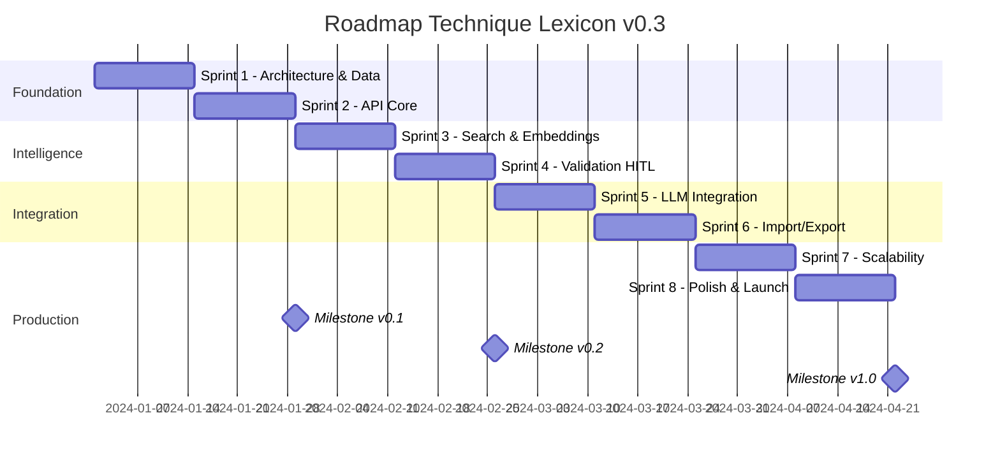

# Roadmap Technique Détaillée v0.3
## Service Générique d'Ontologies Lexicales

---

## 📅 Vue d'Ensemble - 8 Sprints (6 mois)



---

## 🏗️ Phase 1: Foundation (Sprints 1-2)

### Sprint 1: Architecture & Data Model (Semaines 1-2)

#### 🎯 Objectifs
- Décision finale architecture (Neo4j vs PostgreSQL+AGE)
- Schéma de données complet implémenté
- Environnement de développement opérationnel
- CI/CD pipeline configuré

#### 📋 User Stories

```yaml
US1.1:
  title: "POC Benchmark Base de Graphe"
  as_a: Architecte technique
  i_want: Comparer Neo4j vs PostgreSQL+AGE
  so_that: Je peux choisir la meilleure solution
  acceptance_criteria:
    - Dataset de 100k termes, 500k relations
    - Requêtes de test (traversée depth 1-5)
    - Métriques : latence P50/P95/P99, RAM, CPU
    - Rapport comparatif avec recommandation
  estimation: 5 points
  priority: P0

US1.2:
  title: "Schéma Base de Données"
  as_a: Développeur
  i_want: Un schéma PostgreSQL complet
  so_that: Je peux implémenter les modèles
  acceptance_criteria:
    - 20+ tables avec contraintes
    - Indexes optimisés
    - Migrations Alembic
    - Documentation ERD
  estimation: 8 points
  priority: P0

US1.3:
  title: "Docker Compose Development"
  as_a: Développeur
  i_want: Un environnement local complet
  so_that: Je peux développer facilement
  acceptance_criteria:
    - PostgreSQL 15 + pgvector
    - Neo4j Community (si choisi)
    - Redis 7
    - API service
    - Hot reload
  estimation: 3 points
  priority: P0
```

#### 🛠️ Tâches Techniques

| ID | Tâche | Responsable | Durée | Dépendances |
|----|-------|-------------|-------|-------------|
| T1.1 | Setup repository GitHub | DevOps | 2h | - |
| T1.2 | Créer datasets benchmark | Data Eng | 1j | - |
| T1.3 | POC Neo4j traversal | Backend | 2j | T1.2 |
| T1.4 | POC PostgreSQL+AGE | Backend | 2j | T1.2 |
| T1.5 | Analyse comparative | Architecte | 1j | T1.3, T1.4 |
| T1.6 | Implémentation schema SQL | Backend | 3j | T1.5 |
| T1.7 | Configuration pgvector | Backend | 1j | T1.6 |
| T1.8 | Docker Compose setup | DevOps | 1j | - |
| T1.9 | GitHub Actions CI/CD | DevOps | 2j | T1.1 |
| T1.10 | Documentation technique | Tech Lead | 1j | All |

#### 📊 Livrables

- [ ] Rapport benchmark (Neo4j vs PostgreSQL)
- [ ] Schéma SQL avec migrations
- [ ] docker-compose.yml fonctionnel
- [ ] Pipeline CI/CD (tests, linting)
- [ ] README technique

#### ⚠️ Risques

| Risque | Probabilité | Impact | Mitigation |
|--------|------------|--------|------------|
| Neo4j licensing issues | Moyen | Élevé | Préparer fallback PostgreSQL |
| pgvector performance | Faible | Moyen | Alternative : Weaviate |
| Complexité schema | Moyen | Moyen | Review avec expert DB |

---

### Sprint 2: API Core (Semaines 3-4)

#### 🎯 Objectifs
- API REST FastAPI opérationnelle
- CRUD complet termes et relations
- Authentification basique
- Tests unitaires > 80% coverage

#### 📋 User Stories

```yaml
US2.1:
  title: "CRUD Termes"
  as_a: Développeur frontend
  i_want: API complète pour les termes
  so_that: Je peux créer l'interface
  acceptance_criteria:
    - POST /terms (création avec validation)
    - GET /terms (pagination, filtres)
    - GET /terms/{id} (détails complets)
    - PUT /terms/{id} (update versionné)
    - DELETE /terms/{id} (soft delete)
  estimation: 8 points
  priority: P0

US2.2:
  title: "Gestion Relations"
  as_a: Expert ontologie
  i_want: Créer des relations typées
  so_that: Je peux structurer l'ontologie
  acceptance_criteria:
    - POST /relations (avec validation type)
    - GET /terms/{id}/relations
    - Gestion symétrie automatique
    - Détection cycles
  estimation: 5 points
  priority: P0

US2.3:
  title: "API Documentation"
  as_a: Développeur tiers
  i_want: Documentation OpenAPI complète
  so_that: Je peux intégrer l'API
  acceptance_criteria:
    - OpenAPI 3.0 spec auto-générée
    - Exemples pour chaque endpoint
    - Swagger UI accessible
    - Postman collection
  estimation: 2 points
  priority: P1
```

#### 🛠️ Tâches Techniques

| ID | Tâche | Responsable | Durée | Dépendances |
|----|-------|-------------|-------|-------------|
| T2.1 | Setup FastAPI structure | Backend | 4h | Sprint 1 |
| T2.2 | Modèles SQLAlchemy | Backend | 1j | - |
| T2.3 | Pydantic schemas | Backend | 1j | T2.2 |
| T2.4 | CRUD repositories | Backend | 2j | T2.3 |
| T2.5 | API endpoints terms | Backend | 2j | T2.4 |
| T2.6 | API endpoints relations | Backend | 2j | T2.4 |
| T2.7 | Middleware (CORS, logs) | Backend | 4h | T2.1 |
| T2.8 | Basic auth (JWT) | Backend | 1j | T2.1 |
| T2.9 | Unit tests | Backend | 2j | T2.5, T2.6 |
| T2.10 | Integration tests | Backend | 1j | T2.9 |

#### 📊 Livrables

- [ ] API REST fonctionnelle
- [ ] 15+ endpoints documentés
- [ ] Tests coverage > 80%
- [ ] OpenAPI documentation
- [ ] Postman collection

---

## 🧠 Phase 2: Intelligence (Sprints 3-4)

### Sprint 3: Search & Embeddings (Semaines 5-6)

#### 🎯 Objectifs
- Service embeddings opérationnel
- Recherche sémantique fonctionnelle
- Indexation performante
- Fuzzy search implementé

#### 📋 User Stories

```yaml
US3.1:
  title: "Génération Embeddings"
  as_a: Système
  i_want: Générer embeddings pour chaque terme
  so_that: Je peux faire de la recherche sémantique
  acceptance_criteria:
    - Modèle sentence-transformers intégré
    - Génération async (Celery)
    - Stockage pgvector
    - Update automatique si définition change
  estimation: 5 points
  priority: P0

US3.2:
  title: "Recherche Sémantique"
  as_a: Utilisateur
  i_want: Trouver des termes par similarité
  so_that: Je découvre des concepts liés
  acceptance_criteria:
    - GET /search?q=query&mode=semantic
    - Seuil de similarité configurable
    - Top-k results
    - Latence < 500ms
  estimation: 5 points
  priority: P0

US3.3:
  title: "Fuzzy Search"
  as_a: Utilisateur
  i_want: Trouver malgré les fautes de frappe
  so_that: L'expérience est tolérante
  acceptance_criteria:
    - Levenshtein distance
    - Trigram similarity
    - Suggestions automatiques
    - Combinable avec filtres
  estimation: 3 points
  priority: P1
```

#### 🛠️ Tâches Techniques

| ID | Tâche | Responsable | Durée |
|----|-------|-------------|-------|
| T3.1 | Setup Celery + Redis | Backend | 4h |
| T3.2 | Service embeddings | ML Eng | 2j |
| T3.3 | Task génération async | Backend | 1j |
| T3.4 | Indexation pgvector | Backend | 1j |
| T3.5 | API recherche sémantique | Backend | 2j |
| T3.6 | Fuzzy search pg_trgm | Backend | 1j |
| T3.7 | Caching stratégies | Backend | 1j |
| T3.8 | Benchmarks performance | ML Eng | 1j |
| T3.9 | Tests search | Backend | 2j |

---

### Sprint 4: Validation HITL (Semaines 7-8)

#### 🎯 Objectifs
- Workflow validation complet
- Interface validateur basique
- Gestion des conflits
- Métriques qualité

#### 📋 User Stories

```yaml
US4.1:
  title: "Workflow Validation"
  as_a: Validateur expert
  i_want: Un processus de validation clair
  so_that: Je peux valider efficacement
  acceptance_criteria:
    - États : proposed → in_review → validated
    - Attribution automatique validateurs
    - Checklist intégrée
    - Historique complet
  estimation: 8 points
  priority: P0

US4.2:
  title: "Interface Validation"
  as_a: Validateur
  i_want: Une interface simple et efficace
  so_that: Je valide rapidement
  acceptance_criteria:
    - Vue file d'attente triée
    - Formulaire validation guidé
    - Suggestions IA pré-remplies
    - Keyboard shortcuts
  estimation: 8 points
  priority: P0

US4.3:
  title: "Résolution Conflits"
  as_a: Coordinateur
  i_want: Gérer les désaccords
  so_that: La qualité est garantie
  acceptance_criteria:
    - Détection automatique conflits
    - Workflow arbitrage
    - Notifications
    - Audit trail
  estimation: 5 points
  priority: P1
```

#### 🛠️ Interface Validation (SvelteKit)

```svelte
<!-- ValidationQueue.svelte -->
<script>
  import { onMount } from 'svelte';
  import TermCard from './TermCard.svelte';
  import ValidationForm from './ValidationForm.svelte';

  let queue = [];
  let selectedTerm = null;

  onMount(async () => {
    const res = await fetch('/api/v1/validations/queue');
    queue = await res.json();
  });

  function selectTerm(term) {
    selectedTerm = term;
    loadSuggestions(term);
  }
</script>

<div class="flex h-screen">
  <aside class="w-1/3 overflow-y-auto">
    <h2>File de Validation ({queue.length})</h2>
    {#each queue as term}
      <TermCard {term} on:click={() => selectTerm(term)} />
    {/each}
  </aside>

  <main class="w-2/3">
    {#if selectedTerm}
      <ValidationForm term={selectedTerm} />
    {:else}
      <p>Sélectionnez un terme à valider</p>
    {/if}
  </main>
</div>
```

---

## 🔗 Phase 3: Integration (Sprints 5-6)

### Sprint 5: LLM Integration (Semaines 9-10)

#### 🎯 Objectifs
- Service enrichissement prompts
- Détection termes automatique
- Benchmark -30% erreurs
- Cache intelligent

#### 📋 User Stories

```yaml
US5.1:
  title: "Enrichissement Prompts"
  as_a: Application LLM
  i_want: Enrichir mes prompts avec l'ontologie
  so_that: Mes réponses sont plus précises
  acceptance_criteria:
    - POST /llm/enrich
    - Modes : minimal, balanced, full
    - Injection < 100ms
    - Format JSON-LD
  estimation: 8 points
  priority: P0

US5.2:
  title: "Détection Termes"
  as_a: Système
  i_want: Détecter les termes dans un texte
  so_that: Je peux enrichir automatiquement
  acceptance_criteria:
    - NER custom fine-tuned
    - Exact + fuzzy + semantic matching
    - Confidence scores
    - Multi-domaine
  estimation: 5 points
  priority: P0

US5.3:
  title: "Benchmark Réduction Erreurs"
  as_a: Product Owner
  i_want: Prouver -30% erreurs
  so_that: La valeur est démontrée
  acceptance_criteria:
    - Dataset 100 prompts ambigus
    - Évaluation par 3 experts
    - Métriques : précision, hallucinations
    - Rapport détaillé
  estimation: 8 points
  priority: P0
```

#### 🛠️ Architecture LLM

```python
# llm_integration/enrichment_service.py

class EnrichmentService:
    def __init__(self):
        self.term_detector = TermDetector()
        self.graph_builder = GraphBuilder()
        self.context_optimizer = ContextOptimizer()

    async def enrich_prompt(
        self,
        prompt: str,
        domain: Optional[str] = None,
        mode: str = 'balanced',
        max_tokens: int = 2000
    ) -> EnrichedPrompt:

        # 1. Détection multi-stratégies
        detected = await self.term_detector.detect(
            prompt,
            strategies=['exact', 'fuzzy', 'semantic'],
            domain=domain
        )

        # 2. Construction graphe contexte
        context_graph = await self.graph_builder.build(
            detected_terms=detected,
            depth=2 if mode == 'full' else 1,
            max_nodes=20
        )

        # 3. Optimisation budget tokens
        optimized = self.context_optimizer.optimize(
            graph=context_graph,
            max_tokens=max_tokens,
            prioritization='detection_confidence'
        )

        # 4. Formatage pour LLM
        formatted = self.format_for_llm(
            context=optimized,
            mode=mode
        )

        return EnrichedPrompt(
            original=prompt,
            detected_terms=detected,
            context=formatted,
            token_count=self.count_tokens(formatted)
        )
```

---

### Sprint 6: Import/Export (Semaines 11-12)

#### 🎯 Objectifs
- Import multi-formats
- Export standards (RDF, SKOS)
- Migration tools
- Documentation complète

#### 📋 User Stories

```yaml
US6.1:
  title: "Import Multi-formats"
  as_a: Chercheur
  i_want: Importer mon lexique existant
  so_that: Je ne repars pas de zéro
  acceptance_criteria:
    - Support : CSV, Excel, JSON, RDF
    - Détection doublons
    - Mapping assisté
    - Rapport d'import
  estimation: 8 points
  priority: P0

US6.2:
  title: "Export Standards"
  as_a: Développeur
  i_want: Exporter en formats standards
  so_that: J'intègre avec d'autres outils
  acceptance_criteria:
    - Formats : JSON-LD, RDF/Turtle, SKOS
    - Export incrémental
    - Versioning
    - Compression
  estimation: 5 points
  priority: P0
```

#### 🛠️ Pipeline Import

```python
# import_export/import_pipeline.py

class ImportPipeline:
    def __init__(self):
        self.parsers = {
            'csv': CSVParser(),
            'excel': ExcelParser(),
            'json': JSONParser(),
            'rdf': RDFParser()
        }

    async def import_file(
        self,
        file: UploadFile,
        mapping: Optional[Dict] = None
    ) -> ImportResult:

        # 1. Détection format
        format = self.detect_format(file)
        parser = self.parsers[format]

        # 2. Parsing
        raw_data = await parser.parse(file)

        # 3. Validation
        validation_errors = self.validate(raw_data)
        if validation_errors:
            return ImportResult(
                success=False,
                errors=validation_errors
            )

        # 4. Détection doublons
        duplicates = await self.find_duplicates(raw_data)

        # 5. Mapping
        if not mapping:
            mapping = await self.auto_map(raw_data)

        mapped_data = self.apply_mapping(raw_data, mapping)

        # 6. Import batch
        imported = await self.batch_import(
            mapped_data,
            handle_duplicates='merge'
        )

        return ImportResult(
            success=True,
            imported_count=len(imported),
            duplicates_found=len(duplicates),
            mapping_used=mapping
        )
```

---

## 🚀 Phase 4: Production (Sprints 7-8)

### Sprint 7: Scalability (Semaines 13-14)

#### 🎯 Objectifs
- Kubernetes deployment
- Monitoring complet
- Load testing
- Optimisations performance

#### 📋 User Stories

```yaml
US7.1:
  title: "Kubernetes Deployment"
  as_a: DevOps
  i_want: Déployer sur K8s
  so_that: L'app scale automatiquement
  acceptance_criteria:
    - Helm charts
    - HPA (auto-scaling)
    - ConfigMaps/Secrets
    - Ingress configuration
  estimation: 8 points
  priority: P0

US7.2:
  title: "Monitoring Stack"
  as_a: SRE
  i_want: Monitorer l'application
  so_that: Je détecte les problèmes
  acceptance_criteria:
    - Prometheus metrics
    - Grafana dashboards
    - Alerting rules
    - Log aggregation (Loki)
  estimation: 5 points
  priority: P0

US7.3:
  title: "Load Testing"
  as_a: Tech Lead
  i_want: Valider la performance
  so_that: Je garantis les SLA
  acceptance_criteria:
    - Scripts k6
    - 1000 req/s sustained
    - P95 < 200ms
    - No memory leaks
  estimation: 5 points
  priority: P0
```

#### 🛠️ Configuration Kubernetes

```yaml
# k8s/deployment.yaml
apiVersion: apps/v1
kind: Deployment
metadata:
  name: lexicon-api
spec:
  replicas: 3
  selector:
    matchLabels:
      app: lexicon-api
  template:
    metadata:
      labels:
        app: lexicon-api
    spec:
      containers:
      - name: api
        image: lexicon/api:v1.0.0
        ports:
        - containerPort: 8000
        env:
        - name: DATABASE_URL
          valueFrom:
            secretKeyRef:
              name: lexicon-secrets
              key: database-url
        resources:
          requests:
            memory: "512Mi"
            cpu: "500m"
          limits:
            memory: "1Gi"
            cpu: "1000m"
        livenessProbe:
          httpGet:
            path: /health
            port: 8000
          initialDelaySeconds: 30
          periodSeconds: 10
        readinessProbe:
          httpGet:
            path: /ready
            port: 8000
          initialDelaySeconds: 5
          periodSeconds: 5

---
apiVersion: autoscaling/v2
kind: HorizontalPodAutoscaler
metadata:
  name: lexicon-api-hpa
spec:
  scaleTargetRef:
    apiVersion: apps/v1
    kind: Deployment
    name: lexicon-api
  minReplicas: 3
  maxReplicas: 10
  metrics:
  - type: Resource
    resource:
      name: cpu
      target:
        type: Utilization
        averageUtilization: 70
  - type: Resource
    resource:
      name: memory
      target:
        type: Utilization
        averageUtilization: 80
```

---

### Sprint 8: Polish & Launch (Semaines 15-16)

#### 🎯 Objectifs
- UI/UX refinements
- Documentation complète
- Onboarding flow
- Launch preparation

#### 📋 User Stories

```yaml
US8.1:
  title: "Onboarding Flow"
  as_a: Nouveau user
  i_want: Comprendre rapidement
  so_that: Je deviens productif
  acceptance_criteria:
    - Tutorial interactif
    - Sample ontology
    - Quick start guide
    - Video walkthrough
  estimation: 5 points
  priority: P0

US8.2:
  title: "Documentation"
  as_a: Tous les users
  i_want: Documentation complète
  so_that: Je trouve mes réponses
  acceptance_criteria:
    - API reference
    - User guides
    - Admin guides
    - Troubleshooting
  estimation: 8 points
  priority: P0

US8.3:
  title: "Landing Page"
  as_a: Visiteur
  i_want: Comprendre la value prop
  so_that: Je m'inscris
  acceptance_criteria:
    - Hero section
    - Features showcase
    - Pricing table
    - Sign up flow
  estimation: 5 points
  priority: P0
```

---

## 📊 Métriques de Succès par Sprint

| Sprint | Métrique Clé | Cible | Mesure |
|--------|--------------|-------|---------|
| **Sprint 1** | Architecture validée | Decision made | POC results |
| **Sprint 2** | API opérationnelle | 15 endpoints | Tests passing |
| **Sprint 3** | Search performance | < 500ms P95 | Benchmarks |
| **Sprint 4** | Validation flow | < 15min/term | Time tracking |
| **Sprint 5** | LLM error reduction | -30% | Expert evaluation |
| **Sprint 6** | Import success rate | > 90% | Import logs |
| **Sprint 7** | Load capacity | 1000 req/s | k6 results |
| **Sprint 8** | Launch readiness | 100% checklist | Launch criteria |

---

## 🚦 Critères de Go/No-Go par Phase

### v0.1 Release (après Sprint 2)
- ✅ 300 termes créés avec relations
- ✅ API REST documentée
- ✅ Tests > 80% coverage
- ✅ Docker Compose fonctionnel

### v0.2 Release (après Sprint 4)
- ✅ 2 domaines actifs
- ✅ Pipeline HITL < 24h
- ✅ Search < 500ms
- ✅ 10 validateurs actifs

### v1.0 Release (après Sprint 8)
- ✅ -30% erreurs LLM prouvé
- ✅ 1000 req/s sustained
- ✅ Documentation complète
- ✅ 100 beta users

---

## 🎯 Allocation des Ressources

| Rôle | Sprint 1-2 | Sprint 3-4 | Sprint 5-6 | Sprint 7-8 |
|------|------------|------------|------------|------------|
| **Tech Lead** | 100% | 100% | 100% | 100% |
| **Backend Dev** | 100% | 100% | 100% | 80% |
| **Frontend Dev** | 20% | 80% | 60% | 100% |
| **ML Engineer** | 0% | 80% | 100% | 20% |
| **DevOps** | 40% | 20% | 20% | 100% |
| **UX Designer** | 20% | 60% | 40% | 80% |
| **Domain Expert** | 20% | 40% | 60% | 40% |

---

## ⚠️ Risques et Contingences

| Risque | Impact | Probabilité | Mitigation | Plan B |
|--------|--------|-------------|------------|--------|
| **Embeddings trop lents** | Élevé | Moyen | Cache agressif | API externe (OpenAI) |
| **HITL bottleneck** | Élevé | Élevé | Gamification + IA assist | Crowd-sourcing |
| **Scale issues** | Élevé | Faible | Load testing early | Vertical scaling |
| **LLM integration complex** | Moyen | Moyen | POC early | Simplified mode |
| **Migration difficile** | Moyen | Élevé | Templates + support | Manual import service |

---

## 📈 Budget Technique

| Catégorie | Coût Mensuel | Coût 6 mois |
|-----------|--------------|-------------|
| **Infrastructure Cloud** | €2,000 | €12,000 |
| **Services (Auth0, etc.)** | €500 | €3,000 |
| **Outils (GitHub, etc.)** | €300 | €1,800 |
| **Embeddings API** | €1,000 | €6,000 |
| **Monitoring** | €400 | €2,400 |
| **Total** | **€4,200** | **€25,200** |

---

*Roadmap Technique v0.3 - Service Générique d'Ontologies Lexicales*
*Dernière mise à jour : 2025-11-11*
*Cette roadmap est ajustable selon les retours des sprints*